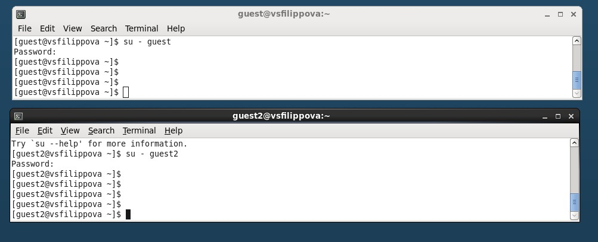
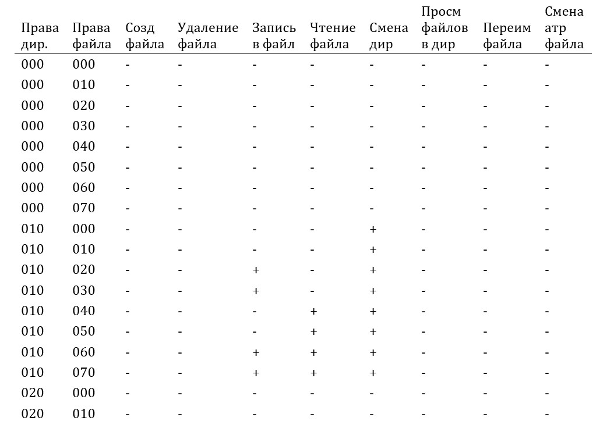
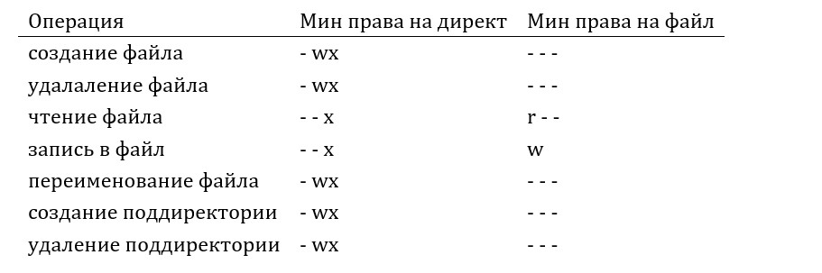

---
## Front matter
lang: ru-RU
title: Лабораторная работа №3
author: |
	Филиппова Вероника Сергеевна - студентка группы НКНбд-01-18
date: 15.10.2021

## Formatting
toc: false
slide_level: 2
theme: metropolis
header-includes:
 - \metroset{progressbar=frametitle,sectionpage=progressbar,numbering=fraction}
 - '\makeatletter'
 - '\beamer@ignorenonframefalse'
 - '\makeatother'
aspectratio: 43
section-titles: true
---

# Дискреционное разграничение прав в Linux. Два пользователя

## Цель выполнения лабораторной работы

Получение практических навыков работы в консоли с атрибутами файлов для групп пользователей

## Задачи выполнения работы

1) Выполнить пункты
2) Заполнить таблицу с правами доступа 
3) Заполнить таблицу с минимальными правами для совершения операций

## Результаты выполнения лабораторной работы. Часть 1

Зашла в двух пользователей с двух консолей.

{ #fig:001 width=70% }

## Результаты выполнения лабораторной работы. Часть 2

Заполнила таблицу 3.1.

{ #fig:002 width=70% }

## Результаты выполнения лабораторной работы. Часть 3

Заполнила таблицу 3.2.

{ #fig:003 width=70% }

## Выводы

Получила практические навыки работы в консоли с атрибутами файлов для групп пользователей.

