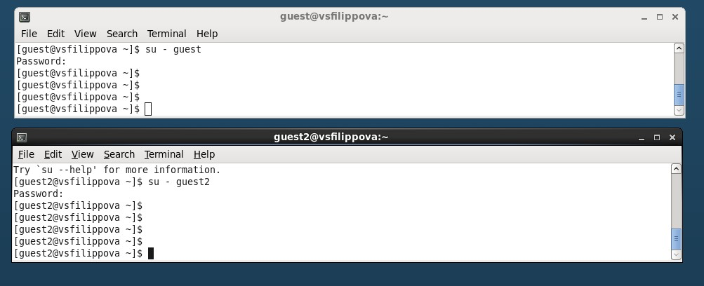
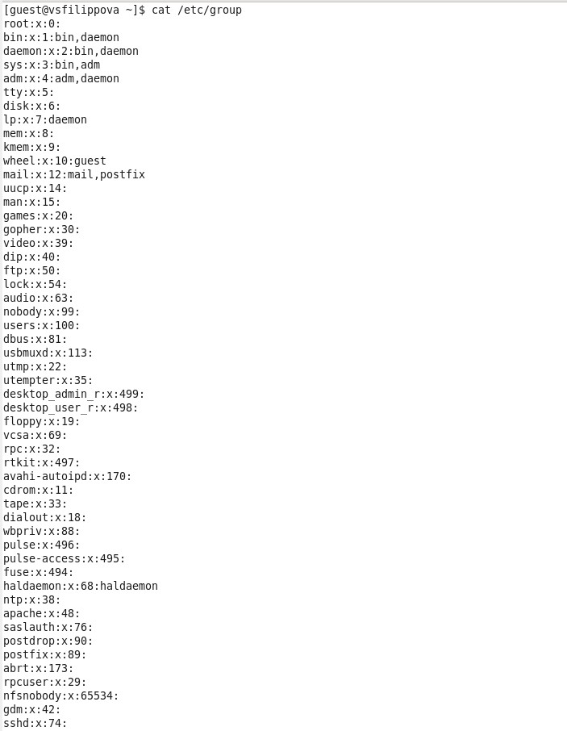

---
# Front matter
title: "Информационная безопасность."
subtitle: "Лабораторная работа №3."
author: "Филиппова Веорника Сергеевна."

# Generic otions
lang: ru-RU
toc-title: "Содержание"

# Bibliography

# Pdf output format
toc: true # Table of contents
toc_depth: 2
lof: true # List of figures
lot: true # List of tables
fontsize: 12pt
linestretch: 1.5
papersize: a4
documentclass: scrreprt
## I18n
polyglossia-lang:
  name: russian
  options:
  - spelling=modern
  - babelshorthands=true
polyglossia-otherlangs:
  name: english
### Fonts
mainfont: PT Serif
romanfont: PT Serif
sansfont: PT Sans
monofont: PT Mono
mainfontoptions: Ligatures=TeX
romanfontoptions: Ligatures=TeX
sansfontoptions: Ligatures=TeX,Scale=MatchLowercase
monofontoptions: Scale=MatchLowercase,Scale=0.9
## Biblatex
biblatex: true
biblio-style: "gost-numeric"
biblatexoptions:
  - parentracker=true
  - backend=biber
  - hyperref=auto
  - language=auto
  - autolang=other*
  - citestyle=gost-numeric
## Misc options
indent: true
header-includes:
  - \linepenalty=10 # the penalty added to the badness of each line within a paragraph (no associated penalty node) Increasing the value makes tex try to have fewer lines in the paragraph.
  - \interlinepenalty=0 # value of the penalty (node) added after each line of a paragraph.
  - \hyphenpenalty=50 # the penalty for line breaking at an automatically inserted hyphen
  - \exhyphenpenalty=50 # the penalty for line breaking at an explicit hyphen
  - \binoppenalty=700 # the penalty for breaking a line at a binary operator
  - \relpenalty=500 # the penalty for breaking a line at a relation
  - \clubpenalty=150 # extra penalty for breaking after first line of a paragraph
  - \widowpenalty=150 # extra penalty for breaking before last line of a paragraph
  - \displaywidowpenalty=50 # extra penalty for breaking before last line before a display math
  - \brokenpenalty=100 # extra penalty for page breaking after a hyphenated line
  - \predisplaypenalty=10000 # penalty for breaking before a display
  - \postdisplaypenalty=0 # penalty for breaking after a display
  - \floatingpenalty = 20000 # penalty for splitting an insertion (can only be split footnote in standard LaTeX)
  - \raggedbottom # or \flushbottom
  - \usepackage{float} # keep figures where there are in the text
  - \floatplacement{figure}{H} # keep figures where there are in the text
---

# Цель работы

Получение практических навыков работы в консоли с атрибутами файлов для групп пользователей

# Задание

1) Выполнить пункты
2) Заполнить таблицу с правами доступа 
3) Заполнить таблицу с минимальными правами для совершения операций

# Выполнение лабораторной работы

С помощью команды `useradd guest` и `useradd guest2` создала две учетные записи. Так как при выполнении предыдущей лабораторной работы я их уже создавала, то терминал выводит ошибку.

{ #fig:001 width=70% }

Добавила пользователя guest2 в группу guest.

{ #fig:002 width=70% }

Зашла в двух пользователей с двух консолей.

{ #fig:003 width=70% }

Для обоих пользователей командой pwd определила директорию, в которой нахожусь. 

{ #fig:004 width=70% }

Уточнила имя пользователя, его группу, и к каким группам он принадлежит командами: `groups guest` и `groups guest2`, `id -Gn` и `id -G`. \

- `groups guest` показывает имя пользователя и группу,
- `id -Gn` показывает только имя группы, 
- `id -G` показывает номер группы.  

{ #fig:005 width=70% }

{ #fig:006 width=70% }

Сравнила полученную информацию с содержимым файла `/etc/group`.
Просмотрел файл командой `cat /etc/group`. В файле информация о пользователях guest и guest2

{ #fig:007 width=70% }

{ #fig:008 width=70% }

От имени пользователя guest2 выполнила регистрацию пользователя guest2 в группе guest командой `newgrp guest`

{ #fig:009 width=70% }

От имени пользователя guest изменила права директории `/home/guest`, разрешив все действия для пользователей группы:
`chmod g+rwx /home/guest`

{ #fig:010 width=70% }

Заполнила таблицу 3.1. "Установленные права и разрешённые действия для групп" 

|Права дир.|Права файла|Созд файла|Удаление файла|Запись в файл|Чтение файла|Смена дир|Просм файлов в дир|Переим файла|Смена атр файла|
|----------|-----------|----------|--------------|-------------|------------|---------|------------------|------------|---------------|
|000       |000        |-         |-             |-            |-           |-        |-                 |-           |-              |
|000       |010        |-         |-             |-            |-           |-        |-                 |-           |-              |
|000       |020        |-         |-             |-            |-           |-        |-                 |-           |-              |
|000       |030        |-         |-             |-            |-           |-        |-                 |-           |-              |
|000       |040        |-         |-             |-            |-           |-        |-                 |-           |-              |
|000       |050        |-         |-             |-            |-           |-        |-                 |-           |-              |
|000       |060        |-         |-             |-            |-           |-        |-                 |-           |-              |
|000       |070        |-         |-             |-            |-           |-        |-                 |-           |-              |
|010       |000        |-         |-             |-            |-           |+        |-                 |-           |-              |
|010       |010        |-         |-             |-            |-           |+        |-                 |-           |-              |
|010       |020        |-         |-             |+            |-           |+        |-                 |-           |-              |
|010       |030        |-         |-             |+            |-           |+        |-                 |-           |-              |
|010       |040        |-         |-             |-            |+           |+        |-                 |-           |-              |
|010       |050        |-         |-             |-            |+           |+        |-                 |-           |-              |
|010       |060        |-         |-             |+            |+           |+        |-                 |-           |-              |
|010       |070        |-         |-             |+            |+           |+        |-                 |-           |-              |
|020       |000        |-         |-             |-            |-           |-        |-                 |-           |-              |
|020       |010        |-         |-             |-            |-           |-        |-                 |-           |-              |
|020       |020        |-         |-             |-            |-           |-        |-                 |-           |-              |
|020       |030        |-         |-             |-            |-           |-        |-                 |-           |-              |
|020       |040        |-         |-             |-            |-           |-        |-                 |-           |-              |
|020       |050        |-         |-             |-            |-           |-        |-                 |-           |-              |
|020       |060        |-         |-             |-            |-           |-        |-                 |-           |-              |
|020       |070        |-         |-             |-            |-           |-        |-                 |-           |-              |
|030       |000        |+         |+             |-            |-           |+        |-                 |+           |-              |
|030       |010        |+         |+             |-            |-           |+        |-                 |+           |-              |
|030       |020        |+         |+             |+            |-           |+        |-                 |+           |-              |
|030       |030        |+         |+             |+            |-           |+        |-                 |+           |-              |
|030       |040        |+         |+             |-            |+           |+        |-                 |+           |-              |
|030       |050        |+         |+             |-            |+           |+        |-                 |+           |-              |
|030       |060        |+         |+             |+            |+           |+        |-                 |+           |-              |
|030       |070        |+         |+             |+            |+           |+        |-                 |+           |-              |
|040       |000        |-         |-             |-            |-           |-        |-                 |-           |-              |
|040       |010        |-         |-             |-            |-           |-        |-                 |-           |-              |
|040       |020        |-         |-             |-            |-           |-        |-                 |-           |-              |
|040       |030        |-         |-             |-            |-           |-        |-                 |-           |-              |
|040       |040        |-         |-             |-            |-           |-        |-                 |-           |-              |
|040       |050        |-         |-             |-            |-           |-        |-                 |-           |-              |
|040       |060        |-         |-             |-            |-           |-        |-                 |-           |-              |
|040       |070        |-         |-             |-            |-           |-        |-                 |-           |-              |
|050       |000        |-         |-             |-            |-           |+        |+                 |-           |-              |
|050       |010        |-         |-             |-            |-           |+        |+                 |-           |-              |
|050       |020        |-         |-             |+            |-           |+        |+                 |-           |-              |
|050       |030        |-         |-             |+            |-           |+        |+                 |-           |-              |
|050       |040        |-         |-             |-            |+           |+        |+                 |-           |-              |
|050       |050        |-         |-             |-            |+           |+        |+                 |-           |-              |
|050       |060        |-         |-             |+            |+           |+        |+                 |-           |-              |
|050       |070        |-         |-             |+            |+           |+        |+                 |-           |-              |
|060       |000        |-         |-             |-            |-           |-        |+                 |-           |-              |
|060       |010        |-         |-             |-            |-           |-        |+                 |-           |-              |
|060       |020        |-         |-             |-            |-           |-        |+                 |-           |-              |
|060       |030        |-         |-             |-            |-           |-        |+                 |-           |-              |
|060       |040        |-         |-             |-            |-           |-        |+                 |-           |-              |
|060       |050        |-         |-             |-            |-           |-        |+                 |-           |-              |
|060       |060        |-         |-             |-            |-           |-        |+                 |-           |-              |
|060       |070        |-         |-             |-            |-           |-        |+                 |-           |-              |
|070       |000        |+         |+             |-            |-           |+        |+                 |+           |-              |
|070       |010        |+         |+             |-            |-           |+        |+                 |+           |-              |
|070       |020        |+         |+             |+            |-           |+        |+                 |+           |-              |
|070       |030        |+         |+             |+            |-           |+        |+                 |+           |-              |
|070       |040        |+         |+             |-            |+           |+        |+                 |+           |-              |
|070       |050        |+         |+             |-            |+           |+        |+                 |+           |-              |
|070       |060        |+         |+             |+            |+           |+        |+                 |+           |-              |
|070       |070        |+         |+             |+            |+           |+        |+                 |+           |-              |

Заполнила таблицу 2.2 "Минимальные права для совершения операций от имени пользователей входящих в группу".

|Операция|Мин права на директ|Мин права на файл|
|--------|-------------------|-----------------|
|создание файла|- wx               |- - -            |
|удалаление файла|- wx               |- - -            |
|чтение файла|- - x              |r - -            |
|запись в файл|- - x                              |w                        |
|переименование файла|- wx               |- - -            |
|создание поддиректории|- wx               |- - -            |
|удаление поддиректории|- wx               |- - -            |

# Выводы

Получила практические навыки работы в консоли с атрибутами файлов для групп пользователей.